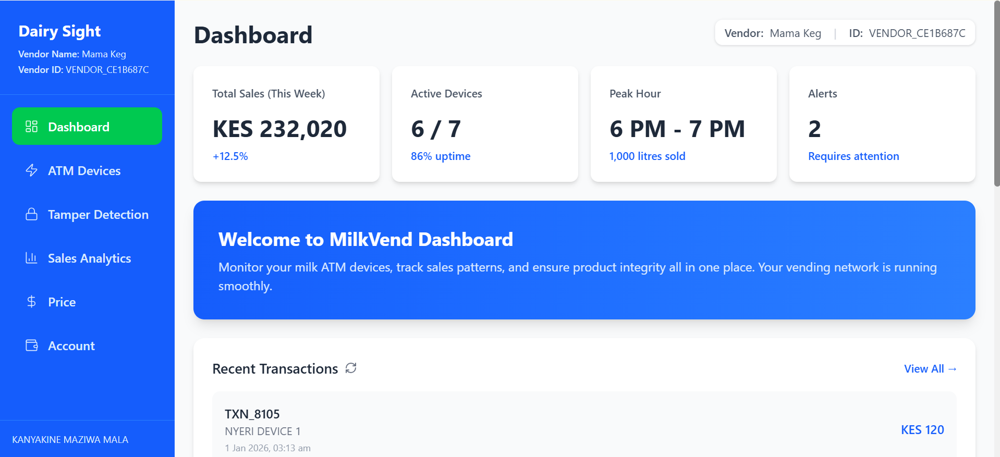
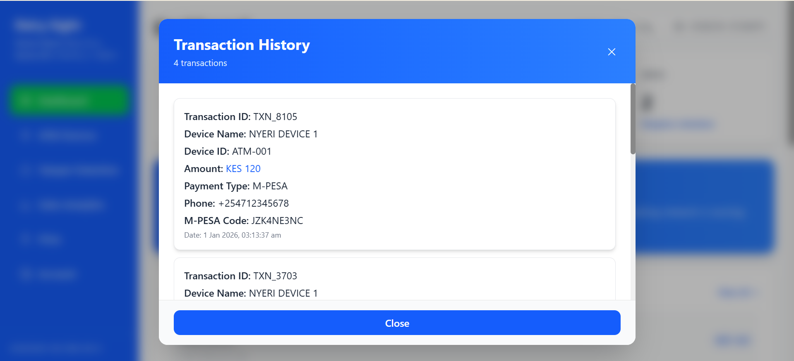
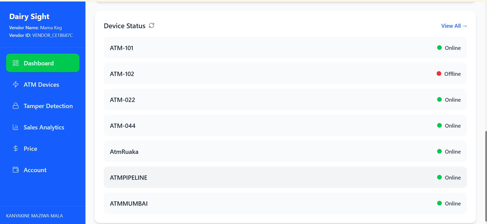
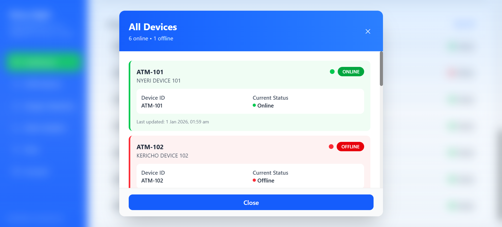
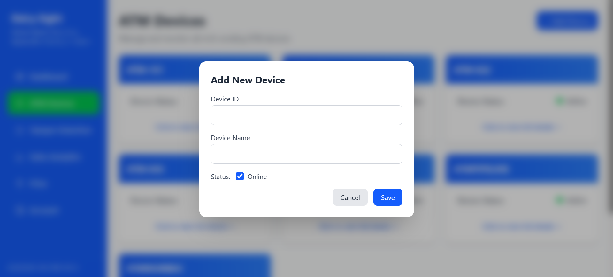
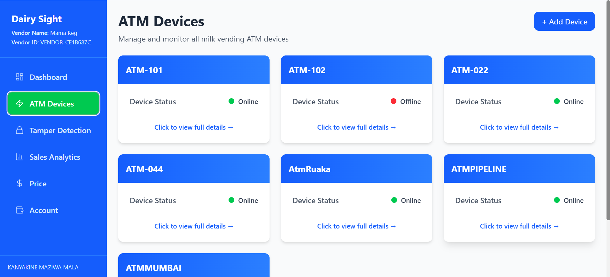
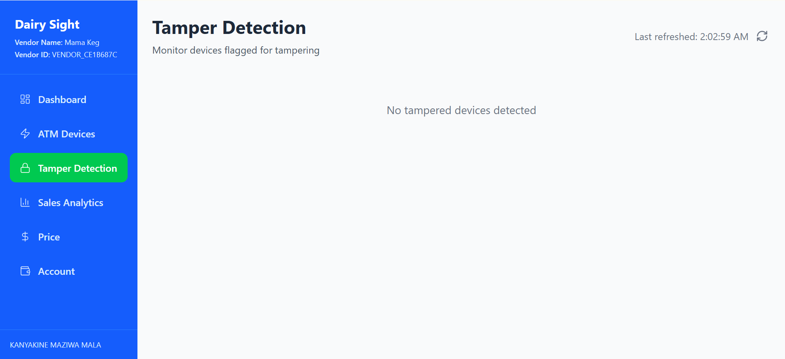
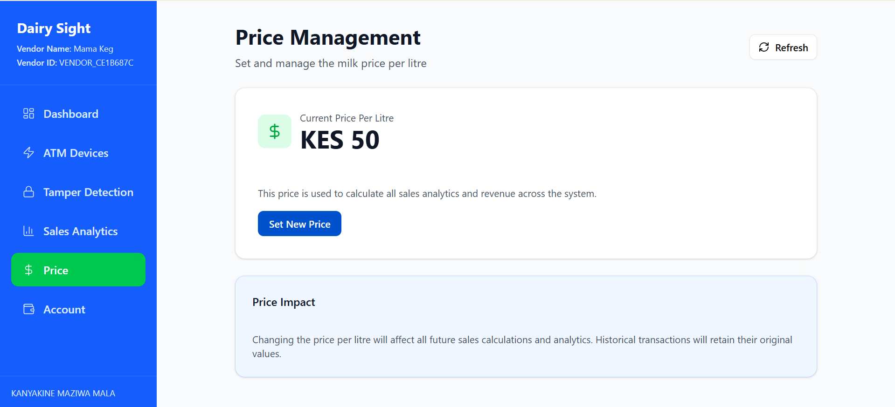
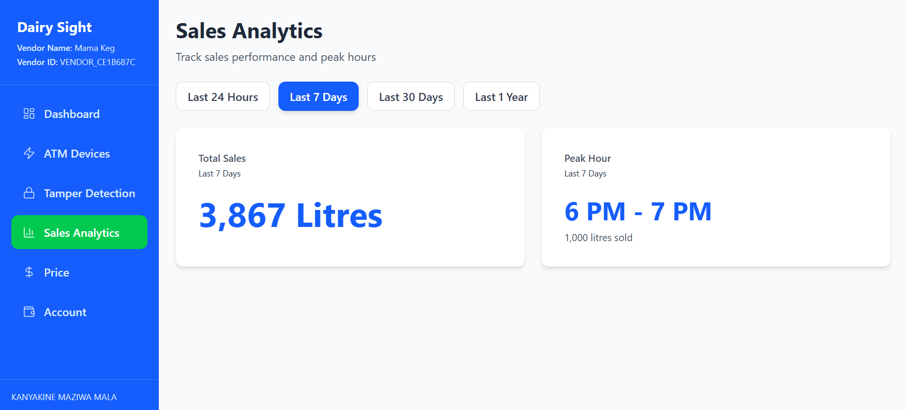
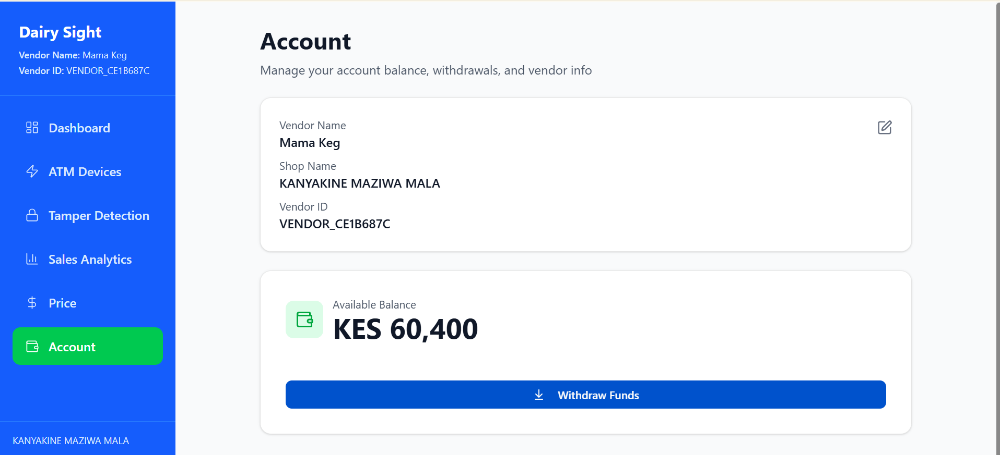

# Mpesa Integrated Milk Vendoring System
This is a milk vendoring system that invloves IoT devices, mpesa integration and database integration. 
The system contains several modules user management, account management,device management, sales analytics, price management and mpesa payments.
The milk vendor machines contain IoT devices that vend milk and communicate to our system for management of data and analytics.
This system contains mpesa payments and uses sqlite database to strore data.

## Overview

This website url is https://dairy-sight-frontend.vercel.app

## Screenshots

